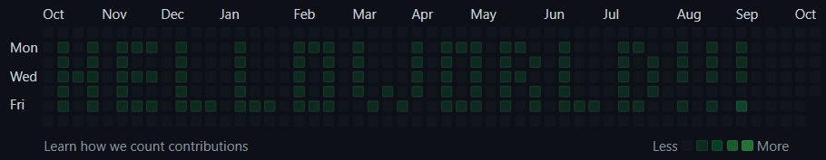

# GitHub's contributions calendar writer

This is a simple script that commits to a GitHub repository every day, so that
the contributions calendar is filled with green squares to write a message.

